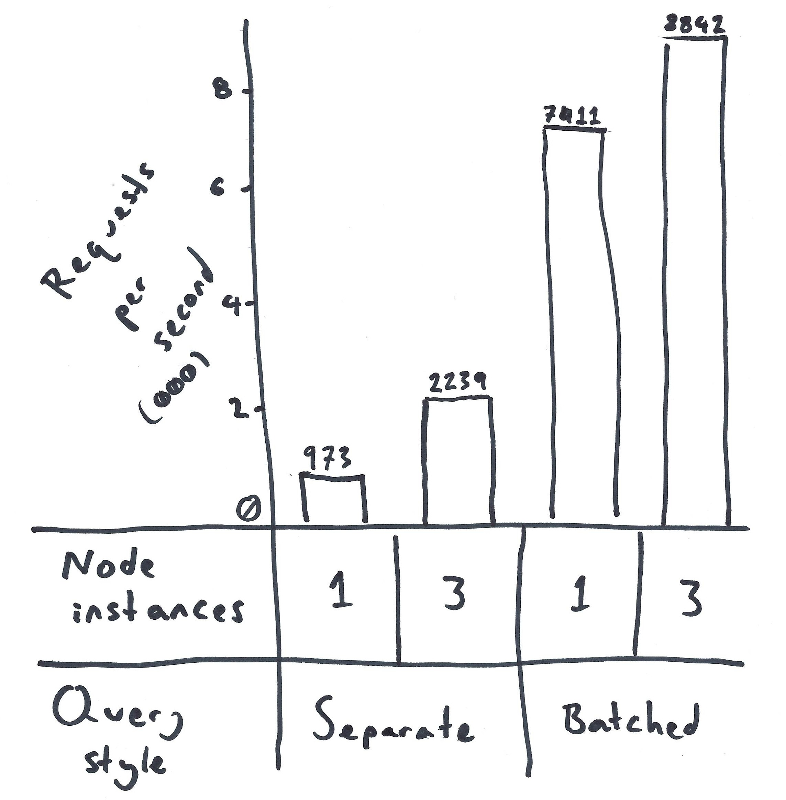

# Carpooling to the database

### Or "7x more backend throughput with this one dumb trick"

## The Premise

Say you want to insert/update/read ten thousand rows in your database. Do you,

<ol type="a">
  <li>Make ten thousand queries in series,</li>
  <li>Make ten thousand concurrent queries, or</li>
  <li>Batch those reads into significantly fewer queries?</li>
</ol>

In the bad old days each of our webserver processes might have done (a). These days it's fashionable to add a bit of (b) to that. This repo shows a way to do (c) in a web backend process.

## But don't requests trickle in one at a time?

If we're struggling under high load, those requests aren't "trickling in"—they're *flooding* in. A lot of those requests will be for the same endpoints. Even for different endpoints, many will have queries in common. Think, "Is this a valid session token?"

Instead of immediately going to the database and using a whole connection all by yourself, why not wait around for a few milliseconds and split the cost with some friends headed the same way?

I don't quite know "the right way" to do this—Should you batch whole requests by endpoint, or just wrap individual queries? This repo is not intended to propose abstractions, just avenues for optimisation that good abstractions could take advantage of.

## Meaningless numbers!

This is a "Hello, World!" Express+Postgres app. Here it is benchmarked both ways:

Near as I could tell from squinting at `top`, requests per second were limited by node, postgres, node and haproxy respectively. The per-query cost in the webserver seems significant, but I haven't done any profiling.

In a table:

 &nbsp; | Separate queries | Batched queries
--|--|--
1 Node instances | 973 | 7411
3 Node instances | 2339 | 8842 reqs/sec

These numbers should only be taken for flavour, and with a grain of salt. They all look suspiciously low to me, the postgres processes didn't want to go above a total of one core, and I haven't made any effort to "measure well".

## Downsides

Lots! Including,

* It means rewriting some code.
* The rewritten code will likely be less readable and less debuggable, at least until good abstractions are found.
* More care must be taken around concurrent/conflicting writes. Probably don't do this if you're doing anything non-trivial with transactions!
* If one request causes a query to barf, other (well-behaved) requests will get it on their shoes.
* Latency could go up. Maybe. I saw it *drop* by a factor of ~ten at max load, but it depends on a lot of things.

## Running the code

Run

    sudo docker-compose up --scale web=3

at the top level after you `git clone`. Then visit http://localhost/single/1 to check it's working. Load test how you like. I ran

    wrk -t1 -c400 -d30s http://localhost/multiple

but you could also just hit `F5` like crazy. The two endpoints are `single` and `multiple`. Both endpoints work with or without the numeric parameter.

## Reading the code

All of the interesting stuff is in [server.js](web/server.js). There's one database table with three columns: an id, and timestamps for each user's last two visits. Webserver responses just signal whether this is the first time a request has been made with a given id parameter (or a randomly chosen id if none is provided.)

There's very little code. Maybe the only interesting part is the definition of `batch`, about 10 lines. (Alas, `batch` is really less like a carpool and more like a bus on a fixed headway. Not a great metaphor.)
